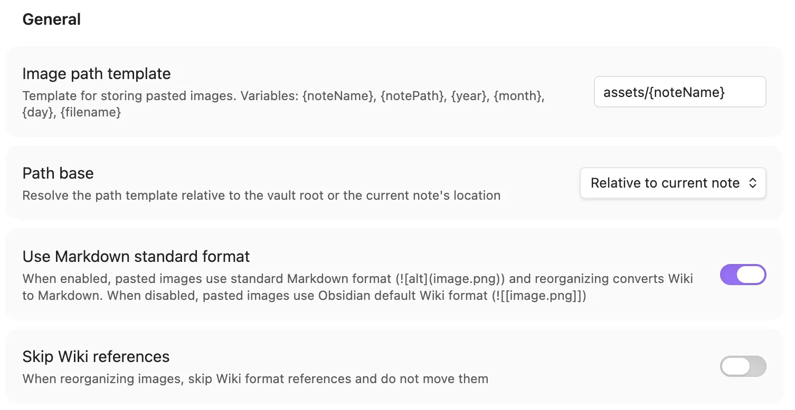
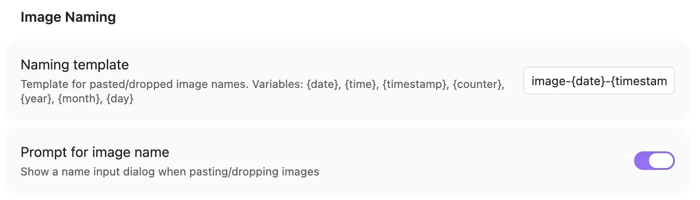
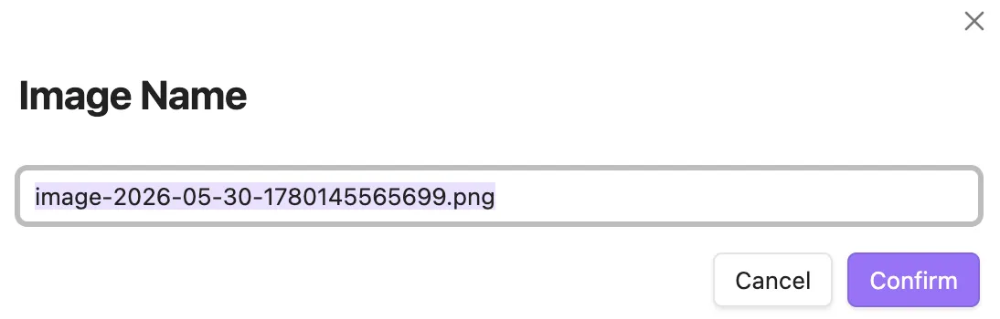
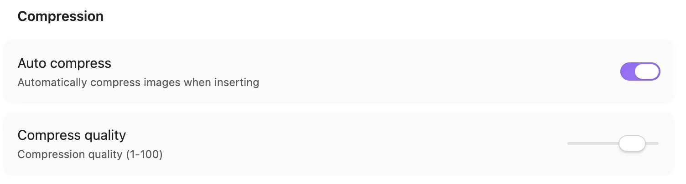
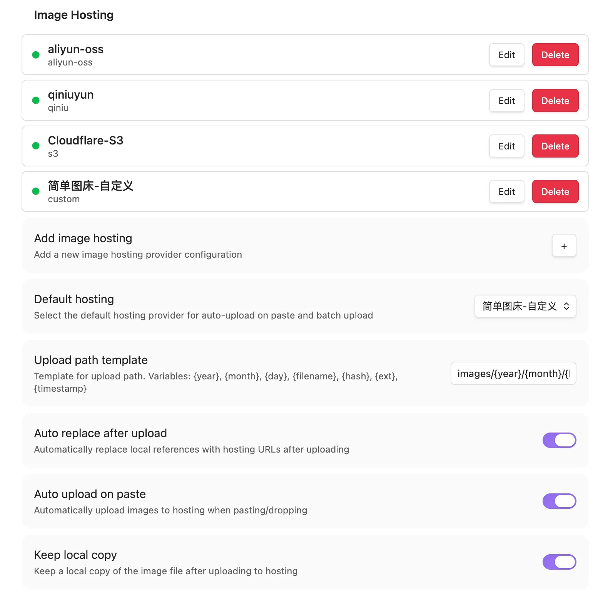
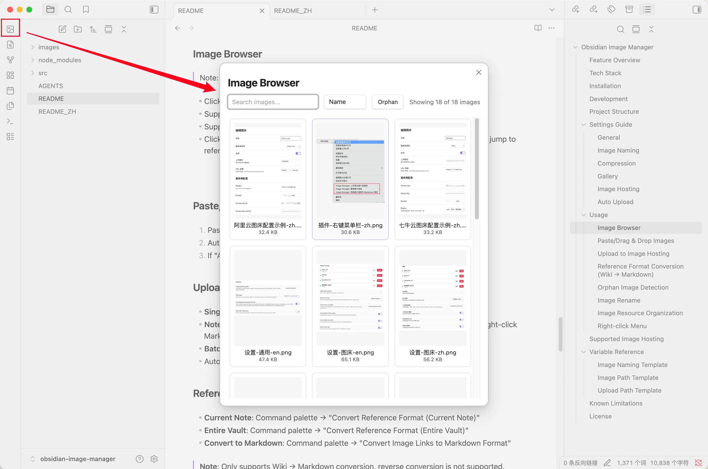
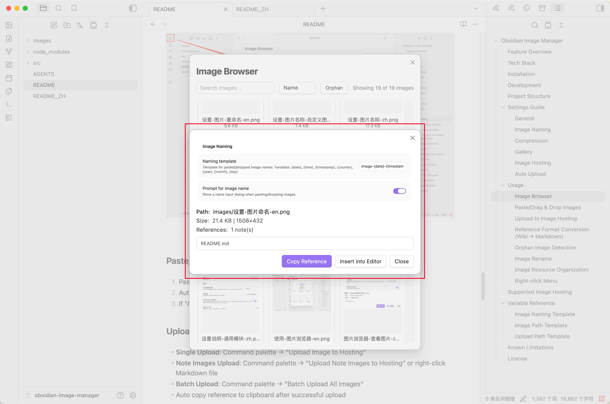
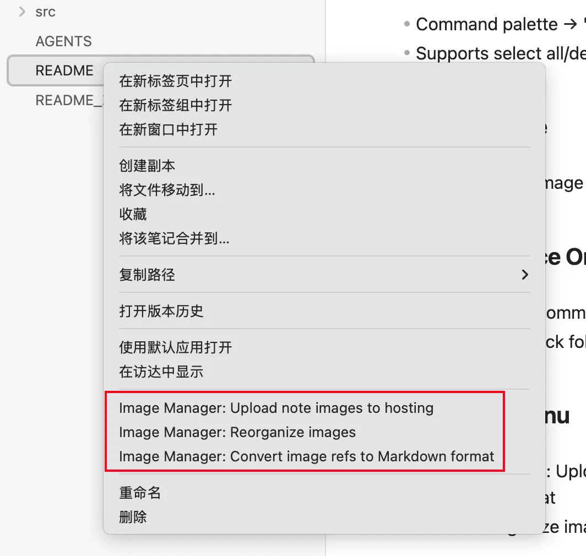

# Obsidian Markdown Image Manager

[](https://obsidian.md/plugins?id=md-image-manager)
[](https://github.com/ytahml/obsidian-image-manager/releases)

English | [中文](README_ZH.md)

Obsidian image management plugin — supports image compression, image hosting upload, reference format conversion, image browser, and more.

> **Note**: This plugin is primarily designed for vaults that use standard Markdown format (``) for image references.
>
> When "Use Markdown standard format" is enabled, features like paste image, organize resources, and image hosting upload all work based on standard Markdown format. The plugin supports batch converting Wiki format (`![[image.png]]`) to standard Markdown format, but does not support reverse conversion.

---

## Feature Overview

| Feature | Status |
| --- | --- |
| Image Browser (Gallery) | ✅ Implemented |
| Image Compression (Canvas API) | ✅ Implemented |
| Wiki → Markdown Reference Conversion | ✅ Implemented |
| Markdown → Wiki Reference Conversion | ❌ Not Supported |
| Image Hosting Upload (Aliyun OSS / Qiniu / S3 / Custom) | ✅ Implemented |
| Auto Upload on Paste | ✅ Implemented |
| Batch Upload Note Images | ✅ Implemented |
| Batch Upload Entire Vault | ✅ Implemented |
| Orphan Image Detection & Cleanup | ✅ Implemented |
| Image Rename (sync update all references) | ✅ Implemented |
| Image Resource Organization (archive by template path) | ✅ Implemented |
| Paste/Drag & Drop Image Auto Processing | ✅ Implemented |
| Right-click Menu Integration | ✅ Implemented |
| Chinese/English Internationalization | ✅ Implemented |
| Image Hosting Migration | ❌ Not Implemented |
| Replace Hosting References with Local | ❌ Not Implemented |

---

## Tech Stack

| Item | Technology |
|------|------------|
| Language | TypeScript 5.8 (strict mode) |
| Runtime | Obsidian Plugin API |
| Bundler | esbuild → CommonJS `main.js` |
| Encryption | Web Crypto API (`crypto.subtle`) |
| HTTP | Obsidian `requestUrl` |
| i18n | Custom i18n (Chinese/English) |
| Lint | ESLint + typescript-eslint + obsidianmd plugin |
| CI | GitHub Actions (Node 20.x / 22.x) |

**Zero external runtime dependencies** — only depends on the `obsidian` package itself.

---

## Installation

1. Search "Markdown Image Manager" in Obsidian Community Plugins to install
2. Or manually download the release package and extract to `.obsidian/plugins/md-image-manager/`
3. Enable the plugin in settings

---

## Development

```bash
# Install dependencies
npm install

# Development mode (watch)
npm run dev

# Production build
npm run build

# Lint
npm run lint

# Automated tests
npm test

# Version update
npm run version
```

Build artifacts: `main.js`, `manifest.json`, `styles.css`

---

## Project Structure

```text
src/
├── main.ts                 # Plugin entry, command registration, event handling, core orchestration
├── settings.ts             # Settings panel UI
├── types.ts                # TypeScript type definitions and defaults
├── constants.ts            # Regular expressions, MIME type mappings
├── i18n/
│   ├── index.ts            # Internationalization system (locale switching, variable interpolation)
│   ├── en.ts               # English translations (~183 entries)
│   └── zh.ts               # Chinese translations (~180 entries)
├── modals/
│   ├── image-browser.ts    # Image gallery browser (grid, search, sort, orphan filter)
│   ├── image-preview-modal.ts  # Image preview (metadata, reference list, upload actions)
│   ├── orphan-images.ts    # Orphan image detection and batch deletion
│   ├── hosting-config.ts   # Image hosting config form (4 providers)
│   ├── confirm-dialog.ts   # Generic confirmation dialog
│   ├── rename-image.ts     # Image rename dialog
│   └── image-name-prompt.ts # Image naming prompt on paste
├── uploaders/
│   ├── uploader-base.ts    # Uploader abstract base class
│   ├── uploader-factory.ts # Uploader factory (instantiate by type)
│   ├── aliyun-oss.ts       # Aliyun OSS (OSS V4 signing)
│   ├── qiniu.ts            # Qiniu Cloud (Token auth, region endpoints)
│   ├── s3-compatible.ts    # S3 compatible storage (AWS SigV4)
│   ├── public-url.ts       # Public URL base normalization and joining
│   ├── custom-uploader.ts  # Custom HTTP endpoint
│   └── upload-queue.ts     # Concurrent upload queue (3 concurrent, 3 retries, progress callback)
└── utils/
    ├── ref-converter.ts    # Reference format parsing and conversion
    ├── image-scanner.ts    # Image scanning, filtering, sorting
    ├── path-utils.ts       # Path utilities, file size formatting, template variables
    ├── public-url.ts       # Markdown-safe Unicode URL display
    ├── orphan-finder.ts    # Orphan image detection, reverse reference query
    ├── image-optimizer.ts  # Canvas compression, format conversion
    ├── batch-rename.ts     # Batch rename (sync update all vault references)
    └── image-reorganizer.ts # Image archive organization (path template, reference update)
```

---

## Settings Guide

### General

- **Language** — Plugin display language (Chinese / English)
- **Image Storage Path Template** — Storage path for pasted images, supports variables:
  - `{noteName}` — Current note name
  - `{notePath}` — Current note path
  - `{year}`, `{month}`, `{day}` — Date
  - `{filename}` — Image filename
- **Path Base** — Resolve path template relative to "vault root" or "current note's directory"
- **Use Markdown Standard Format** — Enable to use `` format, disable to use `![[path]]` Wiki format (image hosting requires this to be enabled)
- **Skip Wiki References** — Skip Wiki format references when organizing images (when disabled, converts Wiki references to MD format)



**Settings Combination Behavior:**

| Use MD Standard | Skip Wiki Refs | Paste Format | Organize Behavior |
| --- | --- | --- | --- |
| ✅ Enabled | ✅ Enabled | `` | Skip Wiki refs, only organize MD format images |
| ✅ Enabled | ❌ Disabled | `` | Convert Wiki refs to MD format and organize (one-way) |
| ❌ Disabled | ✅ Enabled | `![[path]]` | Skip Wiki refs, only organize MD format images |
| ❌ Disabled | ❌ Disabled | `![[path]]` | Organize all format images (preserve original format) |

> **Note**: Wiki → Markdown conversion is one-way and cannot be automatically reversed.

### Image Naming

- **Naming Template** — Supports variables: `{noteName}`, `{date}`, `{time}`, `{timestamp}`, `{counter}`, `{year}`, `{month}`, `{day}`
- **Prompt for Image Name** — Show name input dialog on paste





### Compression

- **Auto Compress** — Automatically compress images on paste
- **Compression Quality** — 1-100, lower value = more compression



### Gallery

- **Thumbnail Size** — 80-400 pixels
- **Enable Image Browser** — Show in sidebar and command palette (requires plugin reload after change)

### Image Hosting

> **Note**: Image hosting requires "Use Markdown Standard Format" to be enabled.

- **Add Image Hosting** — Supports Aliyun OSS, Qiniu Cloud, S3 compatible storage, custom HTTP endpoint
- **Upload Path Template** — Supports `{year}`, `{month}`, `{day}`, `{filename}`, `{ext}`, `{hash}`, `{timestamp}`, `{sourceDir}`
- **Public Access URL Base** — Base URL used to access uploaded objects; it can include a bucket or directory path. Required for Qiniu
- **Auto Replace After Upload** — Automatically replace local references with hosting URL



### Auto Upload

- **Auto Upload on Paste** — Automatically upload to default hosting on paste/drag & drop
- **Keep Local Copy** — Whether to keep local file after upload

---

## Usage

### Image Browser

> Note: The image browser only manages local images, not images on image hosting.

- Click the image icon in the left sidebar to open
- Supports search, sort (name/size/modified time/created time)
- Supports orphan image filtering
- Click thumbnail to preview, can copy reference, insert to editor, upload to hosting, jump to referencing note





### Paste/Drag & Drop Images

1. Paste or drag & drop image into note
2. Auto save to configured path, insert reference
3. If "Auto Upload" is enabled, async upload to hosting and replace reference

### Upload to Image Hosting

- **Single Upload**: Command palette → "Upload Image to Hosting"
- **Note Images Upload**: Command palette → "Upload Note Images to Hosting" or right-click Markdown file
- **Batch Upload**: Command palette → "Batch Upload All Images"
- Auto copy reference to clipboard after successful upload

### Reference Format Conversion (Wiki → Markdown)

- **Current Note**: Command palette → "Convert Reference Format (Current Note)"
- **Entire Vault**: Command palette → "Convert Reference Format (Entire Vault)"
- **Convert to Markdown**: Command palette → "Convert Image Links to Markdown Format"

> **Note**: Only supports Wiki → Markdown conversion, reverse conversion is not supported.

### Orphan Image Detection

- Command palette → "Find Orphan Images"
- Supports select all/deselect all, batch deletion

### Image Rename

- Image browser preview → "Rename" button, or command palette → "Rename image", or right-click file → rename in file explorer
- Auto sync update all markdown references, preserving directory paths

### Image Resource Organization

- **Current Note**: Command palette → "Organize Image Resources"
- **Folder**: Right-click folder → "Organize Image Resources"

### Right-click Menu

- **Markdown Files**: Upload note images to hosting, organize image resources, convert to Markdown format
- **Folders**: Organize image resources



---

## Supported Image Hosting

| Provider | Status | Description |
|----------|--------|-------------|
| Aliyun OSS | ✅ Supported | PUT upload, OSS V4 (HMAC-SHA256) signing |
| Qiniu Cloud | ✅ Supported | Token auth, multipart upload; public access URL base required |
| S3 Compatible Storage | ✅ Supported | AWS SigV4, supports MinIO, Cloudflare R2, etc. |
| Custom | ✅ Supported | Custom URL, Method, Headers, field mapping |

---

## Variable Reference

### Image Naming Template

| Variable | Description | Example |
|----------|-------------|---------|
| `{noteName}` | Current note name (without extension) | `my-note` |
| `{date}` | Current date | `2026-05-30` |
| `{time}` | Current time | `143025` |
| `{timestamp}` | Unix timestamp (milliseconds) | `1748155225123` |
| `{counter}` | Incrementing counter | `1` |
| `{year}` / `{month}` / `{day}` | Date components | `2026` / `05` / `30` |

### Image Path Template

| Variable | Description |
|----------|-------------|
| `{noteName}` | Current note name (without extension) |
| `{notePath}` | Current note's directory path |
| `{year}` / `{month}` / `{day}` | Date |
| `{filename}` | Image filename (without extension) |

### Upload Path Template

| Variable | Description |
|----------|-------------|
| `{year}` / `{month}` / `{day}` | Date |
| `{filename}` | Filename (without extension) |
| `{ext}` | Extension |
| `{hash}` | File content SHA-256 hash (first 16 characters) |
| `{timestamp}` | Unix timestamp |
| `{sourceDir}` | Vault-relative parent directory of the source image |

Provider-specific upload paths override the global template. Aliyun OSS, Qiniu, and S3 use these templates; custom HTTP uploaders continue to use the URL returned by their configured JSON response path.

---

## Known Limitations

- Does not support Markdown → Wiki format conversion (only Wiki → Markdown one-way conversion)
- Image hosting requires "Use Markdown Standard Format" to be enabled
- Clipboard operations use `require('electron')`, not compatible with mobile
- Image hosting migration not yet implemented

---

## Feedback & Support

If you find this plugin helpful, please consider giving it a ⭐ on [GitHub](https://github.com/ytahml/obsidian-image-manager) — it helps others discover it!

- **Bug reports & feature requests**: [GitHub Issues](https://github.com/ytahml/obsidian-image-manager/issues)
- **Email**: orchidsword@163.com

---

## License

ISC License
