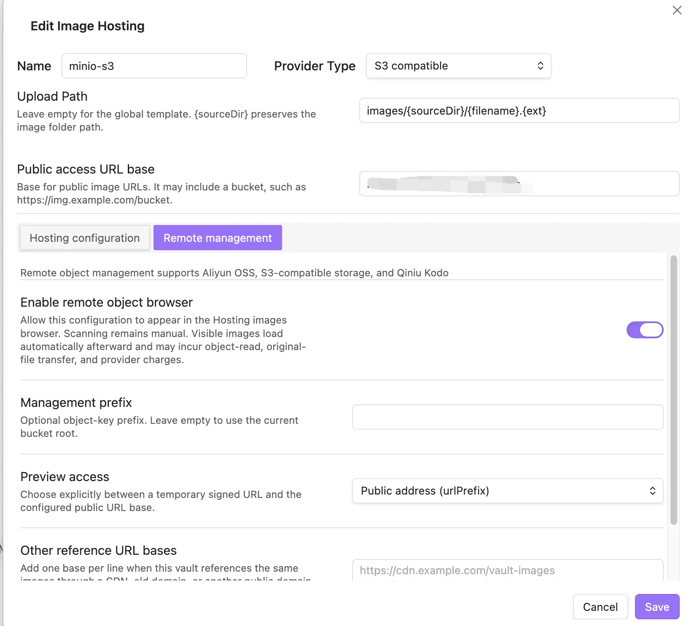
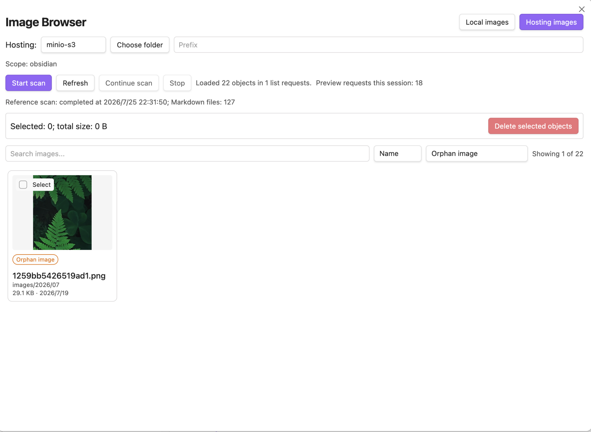

# Obsidian Markdown Image Manager

[](https://obsidian.md/plugins?id=md-image-manager)
[](https://github.com/ytahml/obsidian-image-manager/releases)

English | [中文](README_ZH.md)

Obsidian image management plugin — manage an image from paste or drag-and-drop through naming, compression, hosting upload, reference updates, browsing, reorganization, and guarded cleanup.

> **Note**: This plugin is primarily designed for vaults that use standard Markdown format (``) for image references.
>
> When "Use Markdown standard format" is enabled, features like paste image, organize resources, and image hosting upload all work based on standard Markdown format. The plugin supports batch converting Wiki format (`![[image.png]]`) to standard Markdown format, but does not support reverse conversion.

---

## Feedback & Support

Found a bug or have an idea? [Open a GitHub issue](https://github.com/ytahml/obsidian-image-manager/issues) so it can be tracked and discussed.

To help diagnose problems quickly, include:

- Obsidian and plugin versions
- Steps to reproduce, plus the expected and actual behavior
- Relevant error messages, logs, or screenshots with sensitive vault information removed

For private questions, contact **orchidsword@163.com**. If you find the plugin useful, consider giving the [project a ⭐](https://github.com/ytahml/obsidian-image-manager).

---

## Feature Overview

| Feature | Status |
| --- | --- |
| Image Browser (Local and Hosting Images) | ✅ Implemented |
| Local Reference Status Filter and Guarded Orphan Cleanup | ✅ Implemented |
| Image Compression (Canvas API) | ✅ Implemented |
| Wiki → Markdown Reference Conversion | ✅ Implemented |
| Markdown → Wiki Reference Conversion | ❌ Not Supported |
| Image Hosting Upload (Aliyun OSS / Qiniu / S3 / Custom) | ✅ Implemented |
| Aliyun OSS / S3 / Qiniu Card Browser, Viewport Thumbnails, and Preview | ✅ Implemented |
| Custom Upload Reference Template | ✅ Implemented |
| Auto Upload on Paste | ✅ Implemented |
| Image Lifecycle Management (Managed / Delegated) | ✅ Implemented |
| Batch Upload Note Images | ✅ Implemented |
| Batch Upload Entire Vault | ✅ Implemented |
| Orphan Image Detection & Cleanup | ✅ Implemented |
| Image Rename (sync update all references) | ✅ Implemented |
| Image Resource Organization (archive by template path) | ✅ Implemented |
| Paste/Drag & Drop Image Auto Processing | ✅ Implemented |
| Right-click Menu Integration | ✅ Implemented |
| Chinese/English Internationalization | ✅ Implemented |
| Image Hosting Migration | ❌ Not Implemented |
| Replace Hosting References with Local | ❌ Not Implemented |

---

## Image Lifecycle Management

Image management is more than uploading a file. The plugin follows an image through its local creation, reference insertion, optional upload and exact-reference replacement, later rename or reorganization, and finally guarded orphan cleanup.

- **Managed mode** is the default: this plugin creates the local attachment, applies its naming, path, and optional local-compression settings, then inserts the initial reference.
- **Delegated mode** lets Obsidian or an external attachment manager own that local work. The plugin observes only public Vault events and current resolvable references, then hands the finished attachment to the optional automatic-upload flow without relying on a manager's ID or fixed delay.
- For each delegated paste or drop, the plugin requires a unique attachment-to-reference match. It revalidates the transaction before retries, replacement, and any local cleanup; stale or ambiguous work leaves the local file and reference unchanged.
- If **Keep Local Copy** is disabled, cleanup uses Obsidian's trash only after the attachment is no longer protected by recent lifecycle changes and fresh scans still show no local references. This protects the current vault; it cannot establish that an image is unused outside the vault.

```mermaid
flowchart LR
    A["Paste or drag and drop"] --> B{"Who owns local handling?"}
    B -->|Managed| C["Create attachment\nname, path, optional local compression"]
    B -->|Delegated| D["External manager\ncreates or updates attachment"]
    C --> E["Insert or verify\nlocal reference"]
    D --> E
    E --> F{"Auto upload enabled?"}
    F -->|No| G["Keep local image\nand reference"]
    F -->|Yes| H["Uniquely match one attachment\nto one new reference"]
    H -->|Ambiguous or changed| G
    H -->|Unique| I["Upload hosting payload\nrevalidate before retries"]
    I --> J["Replace the exact reference"]
    J --> K["Browse, rename, or reorganize later"]
    G --> K
    K --> L{"Keep local copy?"}
    L -->|Yes| M["Retain local attachment"]
    L -->|No| N["Fresh scan and change-protection window"]
    N -->|Referenced or changed| M
    N -->|No local reference| O["Move attachment to Obsidian trash"]
```



---

## Tech Stack

| Item | Technology |
|------|------------|
| Language | TypeScript 5.8 (strict mode) |
| Runtime | Obsidian Plugin API |
| Bundler | esbuild → CommonJS `main.js` |
| Encryption | Web Crypto API (`crypto.subtle`) |
| HTTP | Obsidian `requestUrl` |
| i18n | Custom i18n (Chinese/English) |
| Lint | ESLint + typescript-eslint + obsidianmd plugin |
| CI | GitHub Actions (Node 22.x) |

**Zero bundled runtime dependencies** — npm packages are used only for development, type checking, testing, and building.

---

## Installation

1. Open **Settings → Community plugins** in Obsidian and search for "Markdown Image Manager"
2. Alternatively, download a release package and extract it to `.obsidian/plugins/md-image-manager/`
3. Reload Obsidian if needed, then enable the plugin under **Settings → Community plugins**

---

## Development

```bash
# Install dependencies
npm install

# Development mode (watch)
npm run dev

# Production build
npm run build

# Lint
npm run lint

# Automated tests
npm test

# Version update (choose the appropriate SemVer level)
npm version patch
# npm version minor
# npm version major
```

Build artifacts: `main.js`, `manifest.json`, `styles.css`

---

## Project Structure

```text
src/
├── main.ts                 # Plugin entry, command registration, event handling, core orchestration
├── settings.ts             # Settings panel UI
├── types.ts                # TypeScript type definitions and defaults
├── constants.ts            # Regular expressions, MIME type mappings
├── i18n/
│   ├── index.ts            # Internationalization system (locale switching, variable interpolation)
│   ├── en.ts               # English translations (300+ entries)
│   └── zh.ts               # Chinese translations (300+ entries)
├── modals/
│   ├── image-browser.ts    # Local/remote image browser shell
│   ├── remote-image-browser.ts # Remote scan orchestration and safety gates
│   ├── remote-image-grid.ts # Progressive card grid and viewport thumbnails
│   ├── remote-image-preview.ts # Remote preview and reference locations
│   ├── remote-folder-picker.ts # Provider virtual-folder picker
│   ├── remote-delete-confirm.ts # Guarded remote delete confirmation
│   ├── remote-delete-results.ts # Per-object delete results
│   ├── image-preview-modal.ts  # Image preview (metadata, reference list, upload actions)
│   ├── orphan-images.ts    # Orphan image detection and batch deletion
│   ├── hosting-config.ts   # Image hosting config form (4 providers)
│   ├── confirm-dialog.ts   # Generic confirmation dialog
│   ├── rename-image.ts     # Image rename dialog
│   └── image-name-prompt.ts # Image naming prompt on paste
├── uploaders/
│   ├── uploader-base.ts    # Uploader abstract base class
│   ├── uploader-factory.ts # Uploader factory (instantiate by type)
│   ├── upload-service.ts   # Unified direct, note, batch, and paste upload orchestration
│   ├── aliyun-oss.ts       # Aliyun OSS (OSS V4 signing)
│   ├── qiniu.ts            # Qiniu Cloud (Token auth, region endpoints)
│   ├── s3-compatible.ts    # S3 compatible storage (AWS SigV4)
│   ├── public-url.ts       # Public URL base normalization and joining
│   ├── custom-uploader.ts  # Custom HTTP endpoint
│   └── upload-queue.ts     # Concurrent upload queue (3 concurrent, 3 retries, progress callback)
├── remote/                 # Provider-independent remote sessions, safety policies, and native providers
├── oss/
│   └── sigv4.ts            # Shared OSS upload/list/preview/delete signing
├── qiniu/
│   └── auth.ts             # Upload, management, and private-preview authentication
├── s3/
│   └── sigv4.ts            # Shared S3 upload/list/preview/delete signing
└── utils/
    ├── ref-converter.ts    # Reference format parsing and conversion
    ├── reference-template.ts # Uploaded reference template validation and rendering
    ├── image-scanner.ts    # Image scanning, filtering, sorting
    ├── local-orphan-management.ts # Fresh local orphan validation and trash
    ├── path-utils.ts       # Path utilities, file size formatting, template variables
    ├── public-url.ts       # Markdown-safe Unicode URL display
    ├── orphan-finder.ts    # Orphan image detection, reverse reference query
    ├── image-optimizer.ts  # Canvas compression, format conversion
    ├── batch-rename.ts     # Batch rename (sync update all vault references)
    └── image-reorganizer.ts # Image archive organization (path template, reference update)
```

---

## Settings Guide

### General

- **Language** — Plugin display language (Chinese / English)
- **Image Storage Path Template** — Storage path for pasted images, supports variables:
  - `{noteName}` — Current note name
  - `{notePath}` — Current note path
  - `{year}`, `{month}`, `{day}` — Date
  - `{filename}` — Image filename
- **Path Base** — Resolve path template relative to "vault root" or "current note's directory"
- **Use Markdown Standard Format** — Enable to use `` format, disable to use `![[path]]` Wiki format (image hosting requires this to be enabled)
- **Skip Wiki References** — Skip Wiki format references when organizing images (when disabled, converts Wiki references to MD format)


**Settings Combination Behavior:**

| Use MD Standard | Skip Wiki Refs | Paste Format | Organize Behavior |
| --- | --- | --- | --- |
| ✅ Enabled | ✅ Enabled | `` | Skip Wiki refs, only organize MD format images |
| ✅ Enabled | ❌ Disabled | `` | Convert Wiki refs to MD format and organize (one-way) |
| ❌ Disabled | ✅ Enabled | `![[path]]` | Skip Wiki refs, only organize MD format images |
| ❌ Disabled | ❌ Disabled | `![[path]]` | Organize all format images (preserve original format) |

> **Note**: Wiki → Markdown conversion is one-way and cannot be automatically reversed.

### Image Naming

- **Naming Template** — Supports variables: `{noteName}`, `{date}`, `{time}`, `{timestamp}`, `{counter}`, `{year}`, `{month}`, `{day}`
- **Prompt for Image Name** — Show name input dialog on paste


### Compression

- **Auto Compress** — Automatically compress images on paste
- **Compression Quality** — 1-100, lower value = more compression


### Gallery

- **Thumbnail Size** — 80-400 pixels
- **Enable Image Browser** — Show in sidebar and command palette (requires plugin reload after change)
- **Reference Status Filter** — Filter local cards by all, referenced, or orphan status after the reference scan completes

### Image Hosting

> **Note**: Image hosting is independent of the managed paste-reference format. Upload results use standard Markdown or a valid custom reference template.

- **Add Image Hosting** — Supports Aliyun OSS, Qiniu Cloud, S3 compatible storage, custom HTTP endpoint
- **Upload Path Template** — Supports `{year}`, `{month}`, `{day}`, `{filename}`, `{ext}`, `{hash}`, `{timestamp}`, `{sourceDir}`
- **Public Access URL Base** — Base URL used to access uploaded objects; it can include a bucket or directory path. Required for Qiniu
- **Custom Reference Template** — Optional upload-only template; `{fileUrl}` is required and file metadata or intrinsic dimensions can be included
- **Auto Replace After Upload** — Automatically replace local references with hosting URL
- **Remote Object Management** — Available for Aliyun OSS, Qiniu Kodo, and S3-compatible configurations; scanning remains explicit
- **Management Prefix** — Limits remote scanning to a bucket prefix; an empty value means the current bucket root and requires confirmation
- **Other Reference URL Bases** — One HTTP(S) base per line for recognizing CDN, legacy-domain, or alternate public URLs




#### Remote Management Safety

Aliyun OSS, S3-compatible, and Qiniu remote browsing list objects only after an explicit scan, with a visible loading state for longer scans. Results use an image card grid, and thumbnails load automatically as they approach the viewport; this can incur object-read, original-file transfer, and provider charges. Reference scanning covers Markdown images, plain links, HTML, frontmatter, Wiki wrappers, and raw URLs; every reliably mapped address counts as a reference. Select an image to view its referencing notes and line numbers and jump directly to the source. Objects with no detected reference are labeled "Orphan image" and can be selected for deletion. This does not prove that websites, other vaults, or other applications do not use the object.

Remote object management supports Aliyun OSS, S3-compatible storage, and Qiniu Kodo. In **Other reference URL bases**, enter one HTTP(S) base per line, with each base ending where the object key begins; do not use commas or semicolons as separators. OSS ListObjectsV2 incurs API request charges; private preview uses a 300-second V4 presigned URL, while public preview uses the configured public access URL base. Grant only `oss:ListObjects`, `oss:GetObject` for private previews, and `oss:DeleteObject` when deletion is required. Archive, Cold Archive, and Deep Cold Archive objects are not previewed automatically. Qiniu requires its public access URL base for public previews and private download-token previews; use separate least-privilege credentials for upload, management, and private download where your Qiniu policy requires them.

Deletion requires selecting at most 20 eligible objects, typing the selected count, and acknowledging that cloud deletion cannot be undone. Requests run with at most two concurrent operations and are never retried automatically. Successful operations are shown as "Request successful"; whether storage space is released depends on the provider's deletion and versioning policy. Use a dedicated bucket or prefix, grant only the permissions required, and verify results by scanning the configured scope again. The plugin keeps up to 200 redacted local diagnostic records of completed delete requests; they never participate in remote-existence, reference, or deletion decisions, and do not contain presigned preview URLs or credentials.

### Auto Upload

- **Local Image Management Mode** — Choose **Managed** (this plugin owns local paste/drop handling) or **Delegated** (Obsidian or an external attachment manager owns local handling)
- **Auto Upload on Paste** — Automatically upload to default hosting on paste/drag & drop
- **Keep Local Copy** — Whether to keep local file after upload

In **Delegated** mode, automatic upload waits until it can uniquely match the created attachment with this paste/drop's newly inserted reference. It replaces only that exact reference and keeps the local file when the transaction becomes ambiguous or changes while an upload is in flight.

---

## Usage

### Image Browser

The image browser manages both local images and remote objects from supported hosting configurations.

- Click the image icon in the left sidebar to open
- Switch between **Local images** and **Hosting images**
- Local images support search, sort (name/size/modified time/created time), reference-state filtering, safe orphan selection, and preview
- Remote images support explicit scan/continue/refresh, virtual folders, search, sort, reference-state filtering, viewport thumbnails, preview, and guarded orphan deletion
- Click a thumbnail to preview, copy or insert a local reference, upload a local image, or jump to a referencing note




### Paste/Drag & Drop Images

1. In **Managed** mode, paste or drag & drop an image and the plugin saves it to the configured path and inserts a reference.
2. In **Delegated** mode, Obsidian or an external attachment manager performs that local step.
3. If **Auto Upload on Paste** is enabled, the plugin uploads only after it can validate the attachment and the new reference; it then replaces that exact reference.

### Upload to Image Hosting

- **Single Upload**: Command palette → "Upload Image to Hosting"
- **Note Images Upload**: Command palette → "Upload Note Images to Hosting" or right-click Markdown file
- **Batch Upload**: Command palette → "Batch Upload All Images"
- Auto copy reference to clipboard after successful upload

### Reference Format Conversion (Wiki → Markdown)

- **Current Note**: Command palette → "Convert Reference Format (Current Note)"
- **Entire Vault**: Command palette → "Convert Reference Format (Entire Vault)"
- **Convert to Markdown**: Command palette → "Convert Image Links to Markdown Format"

> **Note**: Only supports Wiki → Markdown conversion, reverse conversion is not supported.

### Orphan Image Detection

- Command palette → "Find Orphan Images"
- The dedicated orphan modal supports select all/deselect all and batch cleanup
- The local browser also supports all/referenced/orphan filtering and revalidates selected orphan images before moving them to Obsidian's configured trash

### Image Rename

- Image browser preview → "Rename" button, or command palette → "Rename image", or right-click file → rename in file explorer
- Auto sync update all markdown references, preserving directory paths

### Image Resource Organization

- **Current Note**: Command palette → "Organize Image Resources"
- **Folder**: Right-click folder → "Organize Image Resources"

### Right-click Menu

- **Markdown Files**: Upload note images to hosting, organize image resources, convert to Markdown format
- **Folders**: Organize image resources


---

## Supported Image Hosting

| Provider | Status | Description |
|----------|--------|-------------|
| Aliyun OSS | ✅ Supported | OSS V4 upload, ListObjectsV2, folders, public/private preview, and guarded delete |
| Qiniu Cloud | ✅ Supported | Token upload, remote list/folders, public/private preview, and guarded delete; public access URL base required |
| S3 Compatible Storage | ✅ Supported | AWS SigV4 upload and remote management; supports MinIO, Cloudflare R2, etc. |
| Custom | ✅ Supported | Custom URL, method, headers, and field mapping; upload only |

---

## Variable Reference

### Image Naming Template

| Variable | Description | Example |
|----------|-------------|---------|
| `{noteName}` | Current note name (without extension) | `my-note` |
| `{date}` | Current date | `2026-05-30` |
| `{time}` | Current time | `143025` |
| `{timestamp}` | Unix timestamp (milliseconds) | `1748155225123` |
| `{counter}` | Incrementing counter | `1` |
| `{year}` / `{month}` / `{day}` | Date components | `2026` / `05` / `30` |

### Image Path Template

| Variable | Description |
|----------|-------------|
| `{noteName}` | Current note name (without extension) |
| `{notePath}` | Current note's directory path |
| `{year}` / `{month}` / `{day}` | Date |
| `{filename}` | Image filename |
| `{timestamp}` | Unix timestamp |

### Upload Path Template

| Variable | Description |
|----------|-------------|
| `{year}` / `{month}` / `{day}` | Date |
| `{filename}` | Filename (without extension) |
| `{ext}` | Extension |
| `{hash}` | File content SHA-256 hash (first 16 characters) |
| `{timestamp}` | Unix timestamp |
| `{sourceDir}` | Vault-relative parent directory of the source image |

Provider-specific upload paths override the global template. Aliyun OSS, Qiniu, and S3 use these templates; custom HTTP uploaders continue to use the URL returned by their configured JSON response path.

### Custom Reference Template

| Variable | Description |
|----------|-------------|
| `{fileUrl}` | Uploaded file URL (required) |
| `{fileAlt}` | Alt text |
| `{fileName}` | Full filename |
| `{fileBaseName}` | Filename without extension |
| `{fileExt}` | Extension |
| `{fileWidth}` / `{fileHeight}` | Intrinsic image dimensions |

Unknown variables, a missing `{fileUrl}`, or unavailable requested dimensions cause the uploaded reference to fall back to standard Markdown.

---

## Known Limitations

- Does not support Markdown → Wiki format conversion (only Wiki → Markdown one-way conversion)
- Hosting results use standard Markdown or a valid custom reference template; the plugin does not generate Wiki-style hosting references
- Remote reference indexing scans Markdown files in the current vault
- Custom HTTP hosting is upload-only because it has no common list, preview, or delete protocol
- Clipboard writes use the browser `navigator.clipboard` API; mobile behavior still depends on the host platform and permissions
- Image hosting migration not yet implemented

---

## License

Zero-Clause BSD (`0BSD`)
