# Obsidian Markdown Image Manager

[](https://obsidian.md/plugins?id=md-image-manager)
[](https://github.com/ytahml/obsidian-image-manager/releases)

[English](README.md) | 中文

Obsidian 图片管理插件 — 支持图片压缩、图床上传、引用格式转换、图片浏览器等功能。

> **说明**：本插件主要面向使用标准 Markdown 格式（``）引用图片的笔记库。
> 
> 开启「使用 Markdown 标准格式」后，粘贴图片、整理资源、图床上传等功能均基于标准 Markdown 格式工作。插件支持将 Wiki 格式（`![[image.png]]`）批量转换为标准 Markdown 格式，但暂不支持反向转换。

---

## 反馈与支持

发现问题或有功能建议？请优先[提交 GitHub Issue](https://github.com/ytahml/obsidian-image-manager/issues)，方便持续跟踪和讨论。

为了更快定位问题，请尽量提供：

- Obsidian 版本和插件版本
- 可复现步骤，以及预期行为和实际行为
- 相关错误信息、日志或截图；提交前请移除笔记库中的敏感信息

如需私下沟通，可发送邮件至 **orchidsword@163.com**。如果插件对你有帮助，也欢迎为 [GitHub 项目点亮 ⭐](https://github.com/ytahml/obsidian-image-manager)。

---

Wiki 格式不利于统一管理图片路径和引用，因此更推荐使用标准 Markdown 图片引用格式：

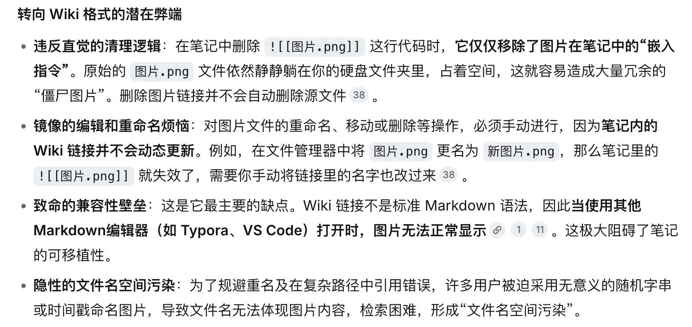

## 功能概览

| 功能                             | 状态     |
| ------------------------------ | ------ |
| 图片浏览器（画廊）                      | ✅ 已实现  |
| 图片压缩（Canvas API）               | ✅ 已实现  |
| Wiki → Markdown 引用格式转换         | ✅ 已实现  |
| Markdown → Wiki 引用格式转换         | ❌ 暂不支持 |
| 图床上传（阿里云 OSS / 七牛云 / S3 / 自定义） | ✅ 已实现  |
| S3 卡片浏览、可视区域缩略图与预览（R2 / MinIO） | ✅ 已实现  |
| 受安全门禁保护的 S3 远程删除（R2 / MinIO）       | ✅ 已实现并通过验收 |
| 粘贴自动上传图床                       | ✅ 已实现  |
| 笔记图片批量上传图床                     | ✅ 已实现  |
| 全库批量上传                         | ✅ 已实现  |
| 孤立图片检测与清理                      | ✅ 已实现  |
| 图片重命名（同步更新所有引用）                | ✅ 已实现  |
| 图片资源整理（按模板路径归档）                | ✅ 已实现  |
| 粘贴/拖放图片自动处理                    | ✅ 已实现  |
| 右键菜单集成                         | ✅ 已实现  |
| 中英文国际化                         | ✅ 已实现  |
| 图床迁移                           | ❌ 未实现  |
| 图床引用替换为本地引用                    | ❌ 未实现  |

---

## S3 远程管理安全说明

S3 远程浏览只有在明确点击扫描后才列举对象；耗时扫描会显示加载状态。扫描结果以图片卡片显示，进入可视区域的缩略图会自动加载，因此可能产生对象读取、原图下载流量和服务商费用。引用检查覆盖 Markdown 图片、普通链接、HTML、frontmatter、Wiki 包裹和原始 URL；只要地址能可靠映射到远程文件，就视为已引用。点击图片可以查看引用笔记及行号并直接跳转。完全未发现引用的对象显示为“孤立图片”并允许选择删除；这不能证明网站、其他仓库或其他应用没有使用该对象。

每批最多选择 20 个符合资格的对象。删除前需要输入所选数量，并勾选已知晓云端删除无法撤销；请求最多 2 个并发，不会自动重试。成功结果统一显示“请求成功”，资源空间是否释放取决于服务商的删除与版本管理策略。建议使用专用 Bucket 或目录前缀、授予最小权限，并通过重新扫描 S3 范围验证结果。临时预览 URL 和凭据不会写入删除历史。

---

## 技术栈

| 项目 | 技术 |
|------|------|
| 语言 | TypeScript 5.8（strict 模式） |
| 运行时 | Obsidian Plugin API |
| 打包 | esbuild → CommonJS `main.js` |
| 加密 | Web Crypto API（`crypto.subtle`） |
| HTTP | Obsidian `requestUrl` |
| 国际化 | 自研 i18n（中/英） |
| Lint | ESLint + typescript-eslint + obsidianmd 插件 |
| CI | GitHub Actions（Node 22.x） |

**零外部运行时依赖** — 仅依赖 `obsidian` 包本身。

---

## 安装

1. 在 Obsidian 中打开 **设置 → 第三方插件**，搜索并安装 "Markdown Image Manager"
2. 或下载 Release 安装包，解压到 `.obsidian/plugins/md-image-manager/`
3. 如有需要，重新加载 Obsidian，然后在 **设置 → 第三方插件** 中启用插件

---

## 开发

```bash
# 安装依赖
npm install

# 开发模式（watch）
npm run dev

# 生产构建
npm run build

# 代码检查
npm run lint

# 自动化测试
npm test

# 版本更新
npm run version
```

构建产物：`main.js`、`manifest.json`、`styles.css`

---

## 项目结构

```text
src/
├── main.ts                 # 插件入口、命令注册、事件处理、核心编排
├── settings.ts             # 设置面板 UI
├── types.ts                # TypeScript 类型定义与默认值
├── constants.ts            # 正则表达式、MIME 类型映射
├── i18n/
│   ├── index.ts            # 国际化系统（locale 切换、变量插值）
│   ├── en.ts               # 英文翻译（300+ 条）
│   └── zh.ts               # 中文翻译（300+ 条）
├── modals/
│   ├── image-browser.ts    # 图片画廊浏览器（网格、搜索、排序、孤立筛选）
│   ├── remote-image-browser.ts # 远程扫描编排与安全门禁
│   ├── remote-image-grid.ts # 渐进卡片网格与可视区域缩略图
│   ├── remote-image-preview.ts # 远程大图预览与引用位置
│   ├── remote-folder-picker.ts # Provider 虚拟文件夹选择
│   ├── remote-delete-confirm.ts # 远程删除安全确认
│   ├── remote-delete-results.ts # 逐对象删除结果
│   ├── image-preview-modal.ts  # 图片预览（元数据、引用列表、上传操作）
│   ├── orphan-images.ts    # 孤立图片检测与批量删除
│   ├── hosting-config.ts   # 图床配置表单（4 种服务商）
│   ├── confirm-dialog.ts   # 通用确认对话框
│   ├── rename-image.ts     # 图片重命名对话框
│   └── image-name-prompt.ts # 粘贴时图片命名提示
├── uploaders/
│   ├── uploader-base.ts    # 上传器抽象基类
│   ├── uploader-factory.ts # 上传器工厂（按类型实例化）
│   ├── aliyun-oss.ts       # 阿里云 OSS（OSS V4 签名）
│   ├── qiniu.ts            # 七牛云（Token 认证、区域端点）
│   ├── s3-compatible.ts    # S3 兼容存储（AWS SigV4）
│   ├── public-url.ts       # 公共访问 URL 基础路径规范化与拼接
│   ├── custom-uploader.ts  # 自定义 HTTP 端点
│   └── upload-queue.ts     # 并发上传队列（3 并发、3 次重试、进度回调）
├── remote/                 # Provider 公共会话、安全策略与 S3 Provider
├── s3/
│   └── sigv4.ts            # S3 上传、列举、预览和删除共享签名
└── utils/
    ├── ref-converter.ts    # 引用格式解析与转换
    ├── image-scanner.ts    # 图片扫描、筛选、排序
    ├── path-utils.ts       # 路径工具、文件大小格式化、模板变量
    ├── public-url.ts       # Markdown URL 的 Unicode 可读化
    ├── orphan-finder.ts    # 孤立图片检测、反向引用查询
    ├── image-optimizer.ts  # Canvas 压缩、格式转换
    ├── batch-rename.ts     # 批量重命名（全库引用同步更新）
    └── image-reorganizer.ts # 图片归档整理（路径模板、引用更新）
```

---

## 设置说明

### 通用

- **语言** — 插件显示语言（中文 / English）
- **图片存储路径模板** — 粘贴图片的存储路径，支持变量：
  - `{noteName}` — 当前笔记名
  - `{notePath}` — 当前笔记路径
  - `{year}`, `{month}`, `{day}` — 日期
  - `{filename}` — 图片文件名
- **路径基准** — 路径模板相对于「库根目录」还是「当前文章所在目录」解析
- **使用 Markdown 标准格式** — 开启后使用 `` 格式，关闭后使用 `![[path]]` Wiki 格式（图床功能需要开启此项）
- **跳过 Wiki 引用** — 整理图片时跳过 Wiki 格式引用（关闭时会将 Wiki 引用转为 MD 格式）

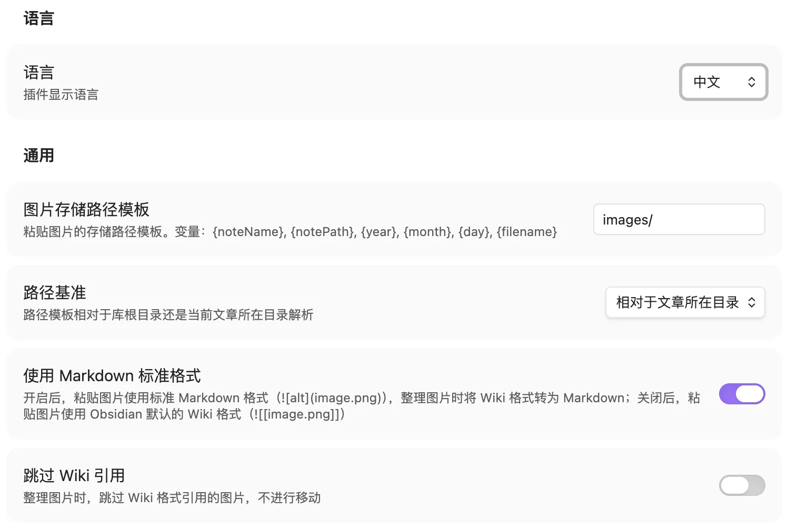

**设置组合行为：**

| 使用 MD 标准格式 | 跳过 Wiki 引用 | 粘贴格式 | 整理行为 |
| --- | --- | --- | --- |
| ✅ 开启 | ✅ 开启 | `` | 跳过 Wiki 引用，仅整理 MD 格式图片 |
| ✅ 开启 | ❌ 关闭 | `` | Wiki 引用转为 MD 格式并整理（单向） |
| ❌ 关闭 | ✅ 开启 | `![[path]]` | 跳过 Wiki 引用，仅整理 MD 格式图片 |
| ❌ 关闭 | ❌ 关闭 | `![[path]]` | 整理所有格式图片（保持原格式） |

> **注意**：Wiki → Markdown 转换为单向操作，转换后无法自动恢复为 Wiki 格式。

### 图片命名

- **命名模板** — 支持变量：`{noteName}`、`{date}`、`{time}`、`{timestamp}`、`{counter}`、`{year}`、`{month}`、`{day}`
- **提示输入图片名称** — 粘贴时弹出名称输入框

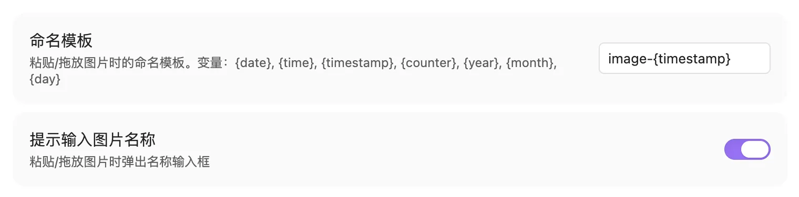

勾选`提示输入图片名称`后，可以自定义图片名称：

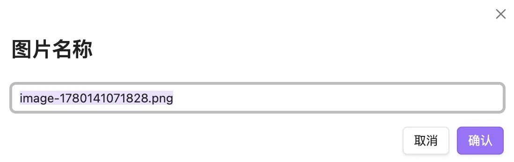

### 压缩

- **自动压缩** — 粘贴图片时自动压缩
- **压缩质量** — 1-100，值越小压缩越狠

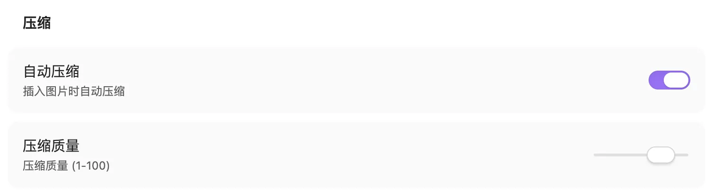

### 画廊

- **缩略图大小** — 80-400 像素
- **启用图片浏览器** — 侧边栏和命令面板中显示（修改后需重新加载插件）

### 图床

> **注意**：图床功能需要开启「使用 Markdown 标准格式」后才能使用。

- **添加图床** — 支持阿里云 OSS、七牛云、S3 兼容存储、自定义 HTTP 端点
- **上传路径模板** — 支持 `{year}`、`{month}`、`{day}`、`{filename}`、`{ext}`、`{hash}`、`{timestamp}`、`{sourceDir}`
- **公共访问 URL 基础路径** — 用于访问上传对象，可包含 bucket 或目录；七牛云必须配置
- **上传后自动替换** — 自动将本地引用替换为图床 URL

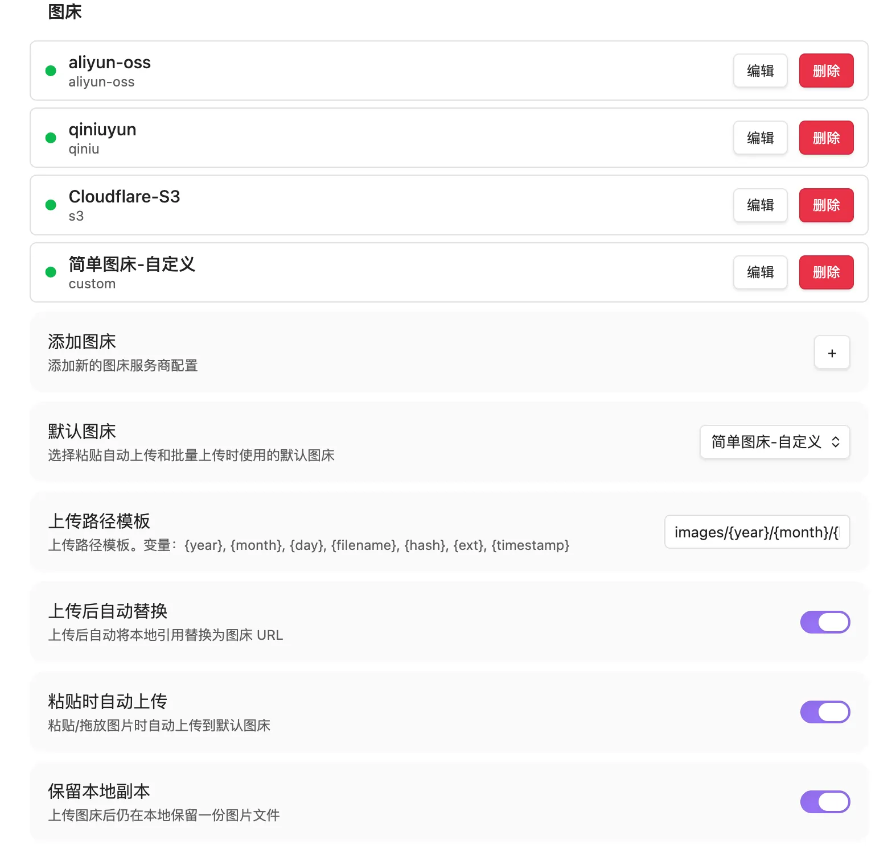

### 自动上传

- **粘贴时自动上传** — 粘贴/拖放时自动上传到默认图床
- **保留本地副本** — 上传后是否保留本地文件；关闭时会清理图片所在的空附件目录

---

## 使用方法

### 图片浏览器

> 注意：图片浏览器只对本地图片进行一个管理，不能管理图床的图片

- 点击左侧栏图片图标打开
- 支持搜索、排序（名称/大小/修改时间/创建时间）
- 支持孤立图片筛选
- 点击缩略图预览，可复制引用、插入编辑器、上传图床、跳转到引用笔记

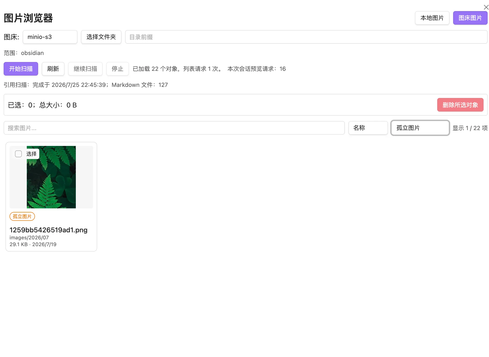

点击图片可以看到图片的详细信息：

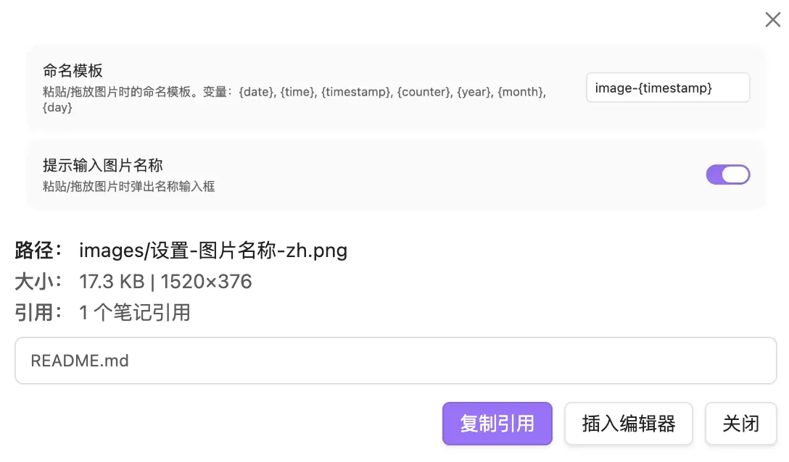

### 粘贴/拖放图片

1. 粘贴或拖放图片到笔记
2. 自动保存到配置路径，插入引用
3. 如开启「自动上传」，异步上传到图床并替换引用

### 上传到图床

- **单张上传**：命令面板 → "上传图片到图床"
- **笔记图片上传**：命令面板 → "上传笔记图片到图床" 或右键 Markdown 文件
- **批量上传**：命令面板 → "批量上传所有图片"
- 上传成功后自动复制引用到剪贴板

### 引用格式转换（Wiki → Markdown）

- **当前笔记**：命令面板 → "转换引用格式（当前笔记）"
- **整个仓库**：命令面板 → "转换引用格式（整个仓库）"
- **转为 Markdown**：命令面板 → "转换图片链接为 Markdown 格式"

> **注意**：仅支持 Wiki 格式转 Markdown 格式，暂不支持反向转换。

### 孤立图片检测

- 命令面板 → "查找孤立图片"
- 支持全选/取消全选，可批量删除

### 图片重命名

- 图片浏览器预览 → "重命名" 按钮，或命令面板 → "重命名图片"，或在文件资源管理器中右键文件 → 重命名
- 自动同步更新所有 markdown 引用，保留目录路径

### 图片资源整理

- **当前笔记**：命令面板 → "整理图片资源"
- **文件夹**：右键文件夹 → "整理图片资源"

### 右键菜单

- **Markdown 文件**：上传笔记图片到图床、整理图片资源、转换为 Markdown 格式
- **文件夹**：整理图片资源

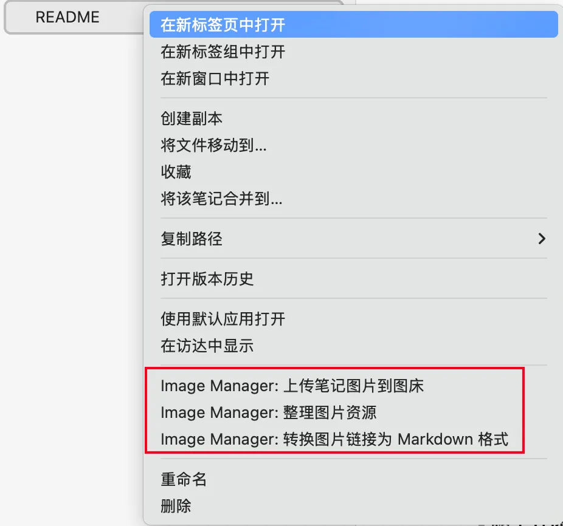

---

## 支持的图床

| 服务商 | 状态 | 说明 |
|--------|------|------|
| 阿里云 OSS | ✅ 已支持 | PUT 上传，OSS V4（HMAC-SHA256）签名 |
| 七牛云 | ✅ 已支持 | Token 认证、multipart 上传，必须配置公共访问 URL 基础路径 |
| S3 兼容存储 | ✅ 已支持 | AWS SigV4，支持 MinIO、Cloudflare R2 等 |
| 自定义 | ✅ 已支持 | 自定义 URL、Method、Headers、字段映射 |

### 阿里云图床示例

> 阿里云作为图床参考文章：[一杯奶茶钱，PicGo + 阿里云 OSS 搭建永久稳定的个人图床](https://www.cnblogs.com/developer-laoliu/articles/19472788)

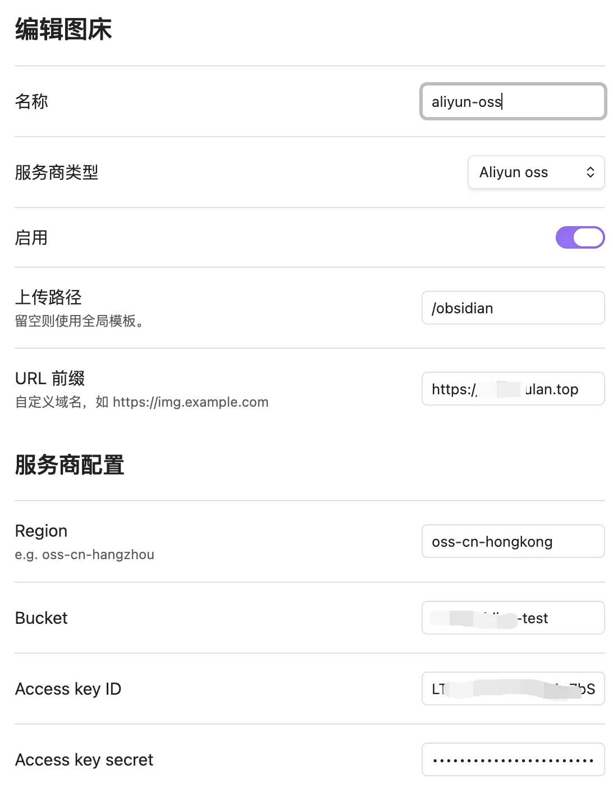

### 七牛云图床示例

> 七牛云作为图床参考文章：[# 如何用七牛云做图床（免费羊毛怎么薅）](https://zhuanlan.zhihu.com/p/612764057)、[VUE使用七牛上传](https://clearives.github.io/page/2017-06-06-qiniu-upload/#token-%E7%9A%84%E8%8E%B7%E5%8F%96)


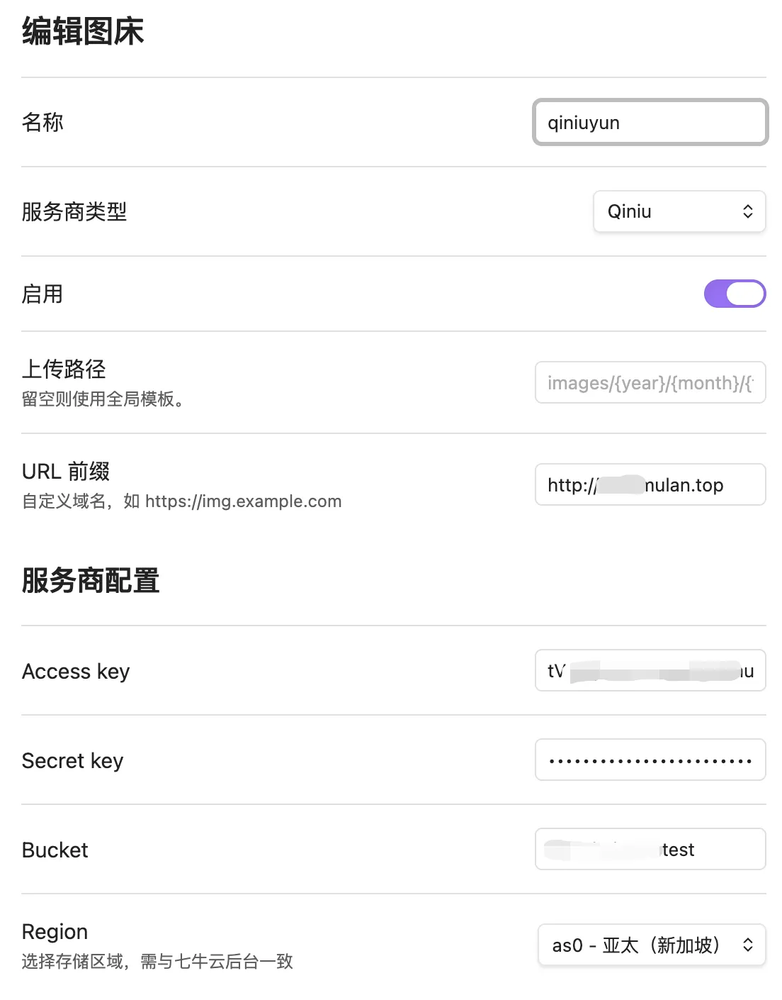

### S3 图床示例

> S3 图床参考文章：[从零开始搭建你的免费图床系统 （Cloudflare R2 + WebP Cloud + PicGo）](https://sspai.com/post/90170)

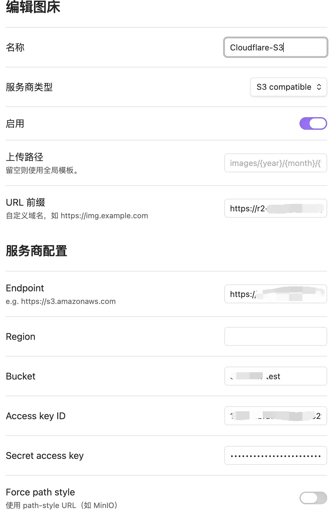

### 自定义图床示例

> 自定义图床使用开源项目：[EasyImage2.0 简单图床](https://github.com/icret/EasyImages2.0)
> 
> 自定义图床部署参考文章：[利用Docker快速搭建EasyImage2.0 简单图床](https://cikeblog.com/quickly-set-up-easyimage2-0-simple-image-bed-using-docker.html "利用Docker快速搭建EasyImage2.0 简单图床")

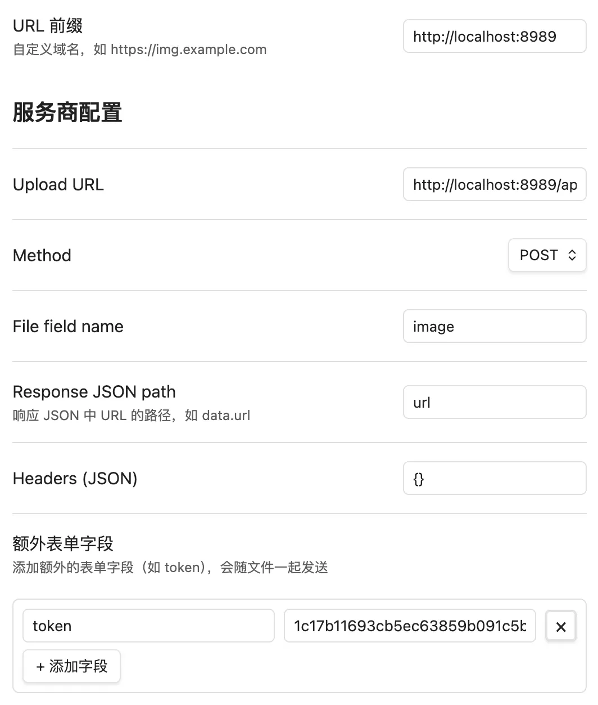

注意响应获取 json 格式是去掉括号的路径，如上述配置对应的响应内容如下所示：

```json
{

"result": "success",

"code": 200,

"url": "http://localhost:8989/i/2026/05/30/md8j6v-0.jpg",

"id": 0,

}
```

---

## 变量参考

### 图片命名模板

| 变量 | 说明 | 示例 |
|------|------|------|
| `{noteName}` | 当前笔记名（不含扩展名） | `my-note` |
| `{date}` | 当前日期 | `2026-05-30` |
| `{time}` | 当前时间 | `143025` |
| `{timestamp}` | Unix 时间戳（毫秒） | `1748155225123` |
| `{counter}` | 递增计数器 | `1` |
| `{year}` / `{month}` / `{day}` | 日期分量 | `2026` / `05` / `30` |

### 图片路径模板

| 变量 | 说明 |
|------|------|
| `{noteName}` | 当前笔记名（不含扩展名） |
| `{notePath}` | 当前笔记所在目录路径 |
| `{year}` / `{month}` / `{day}` | 日期 |
| `{filename}` | 图片文件名（不含扩展名） |

### 上传路径模板

| 变量 | 说明 |
|------|------|
| `{year}` / `{month}` / `{day}` | 日期 |
| `{filename}` | 文件名（不含扩展名） |
| `{ext}` | 扩展名 |
| `{hash}` | 文件内容 SHA-256 哈希（前 16 位） |
| `{timestamp}` | Unix 时间戳 |
| `{sourceDir}` | 源图片相对于 Vault 根目录的父目录 |

图床专属上传路径优先于全局模板。阿里云 OSS、七牛云和 S3 使用这些模板；自定义 HTTP 图床仍以响应 JSON 路径提取出的 URL 为准。

---

## 已知限制

- 暂不支持 Markdown → Wiki 格式转换（仅支持 Wiki → Markdown 单向转换）
- 图床功能需要开启「使用 Markdown 标准格式」后才能使用
- 剪贴板写入使用浏览器 `navigator.clipboard` API；移动端行为仍取决于宿主平台与权限
- 图床迁移功能尚未实现

---

## 许可证

Zero-Clause BSD（`0BSD`）
